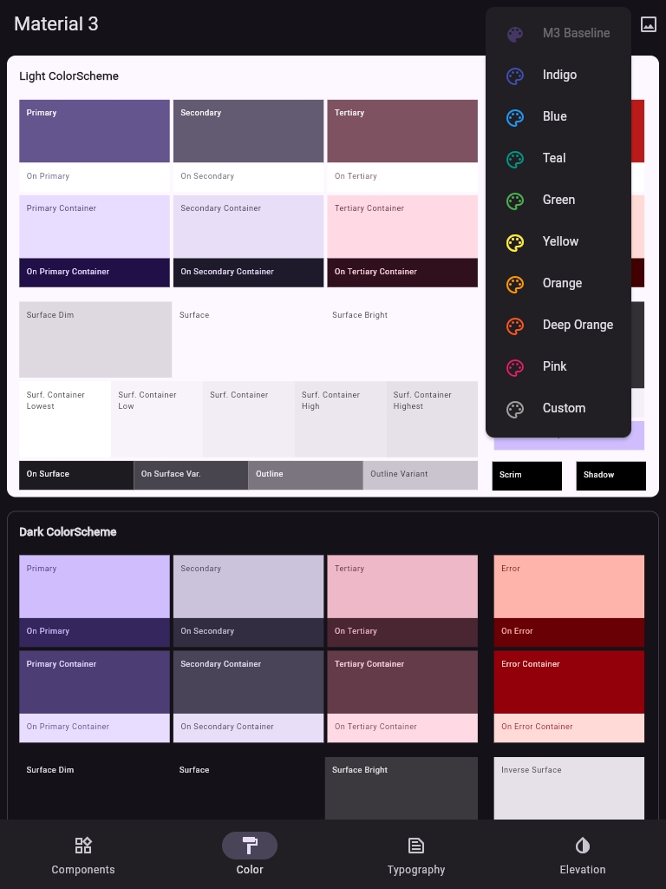
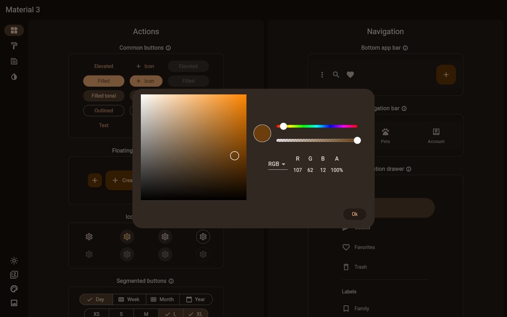

# Material 3 Demo

This is a copy of the *material_3_demo* project from Flutter's [sample](https://github.com/flutter/samples) repository. I didn't fork the repository because I only wanted to clone this specific project. Hopefully that makes it clear that I'm not trying to copy someone else's work and pass it off as my own.

## Additional Features

### Color Scheme Color Picker
My primary modification was to add a color picker (using the [flutter_colorpicker](https://pub.dev/packages/flutter_colorpicker) package) so that a custom color can be used to seed the [ColorScheme](https://api.flutter.dev/flutter/material/ColorScheme-class.html). This makes it easy to see the effect a given color scheme has on the Material components.

To integrate this modification, I added a *custom* entry to the color selector:

When selected, a color picker is displayed in a modal dialog:

The *Ok* button needs to be clicked to apply the color.
 
### Icons List

I then added a list of the Material icons. You can see all of the icons, search for icons, and after selecting an icon you can copy the property name into the clipboard. You can then paste this into your code. Ex: `Icon(Icons.[copied_property_name])`.

To access a live web-based build, go to [https://emmanuelrosa.github.io/material_3_demo/](https://emmanuelrosa.github.io/material_3_demo/).

And now, on to the original README...

This sample Flutter app showcases Material 3 features in the Flutter Material library. These features include updated components, typography, color system and elevation support. The app supports light and dark themes, different color palettes, as well as the ability to switch between Material 2 and Material 3. For more information about Material 3, the guidance is now live at https://m3.material.io/.

This app also includes new M3 components such as IconButtons, Chips, TextFields, Switches, Checkboxes, Radio buttons and ProgressIndicators. 

# Preview

# Features
## Icon Buttons on the Top App Bar
  Users can switch between a light or dark theme with this button.

  Users can switch between Material 2 and Material 3 for the displayed components with this button.

 This button will bring up a pop-up menu that allows the user to change the base color used for the light and dark themes. This uses a new color seed feature to generate entire color schemes from a single color.

## Component Screen
The default screen displays all the updated components in Material 3: AppBar, common Buttons, Floating Action Button(FAB), Chips, Card, Checkbox, Dialog, NavigationBar, NavigationRail, ProgressIndicators, Radio buttons, TextFields and Switch.

### Adaptive Layout
Based on the fact that NavigationRail is not recommended on a small screen, the app changes its layout based on the screen width. If it's played on iOS or Android devices which have a narrow screen, a Navigation Bar will show at the bottom and will be used to navigate. But if it's played as a desktop or a web app, a Navigation Rail will show on the left side and at the same time, a Navigation Bar will show as an example but will not have any functionality.

Users can see both layouts on one device by running a desktop app and adjusting the screen width.

## Color Screen
With Material 3, we have added support for generating a full color scheme from a single seed color. The Color Screen shows users all of the colors in light and dark color palettes that are generated from the currently selected color.

## Typography Screen
The Typography Screen displays the text styles used in for the default TextTheme.

## Elevation Screen
The Elevation screen shows different ways of elevation with a new supported feature "surfaceTintColor" in the Material library.
